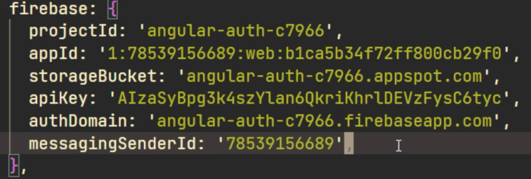
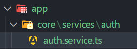

# Video en el que me baso:

https://www.youtube.com/watch?v=Vo8-d2f2dTg

# Version en angular 16

instalamos angular material y angularfire:

```bash
ng add @angular/material
ng add @angular/fire
```

Tambien necesitamos instalar las tools de firebase para logearnos desde el terminal.

```bash
npm install -g firebase-tools
```

1. Nos logemaos:

```bash
firebase login
```

en `app.config.ts` vemos que esta todo listo para poder trabajar

> Esta información no os la puedo mostrar pero puedo mostraros un ejemplo:



2. Cuando ya tengamos el formulario de registro y login creados. Cremoas el auth.service.ts

3. El `auth.service.ts `lo creamos dentro de `app` en `core `y dentro de core en `services` y en `auth` dentro de service:



4. injectamos `auth`

```ts
import { inject, Injectable } from "@angular/core";
import { Auth } from "@angular/fire/auth";

@Injectable({
  providedIn: "root",
})
export class AuthService {
  private auth: Auth = inject(Auth); // Inject the Auth service from AngularFire
}
```

5. Codigo completo de `auth.service.ts`

```ts

```
